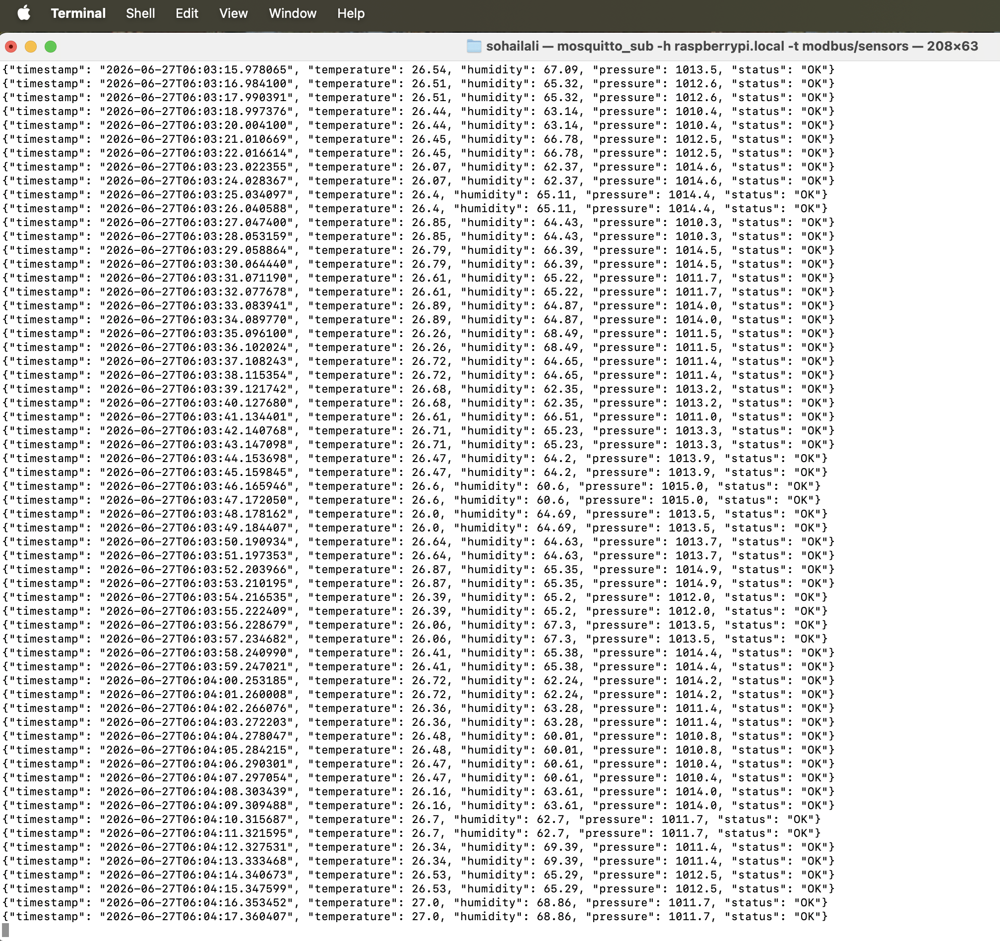
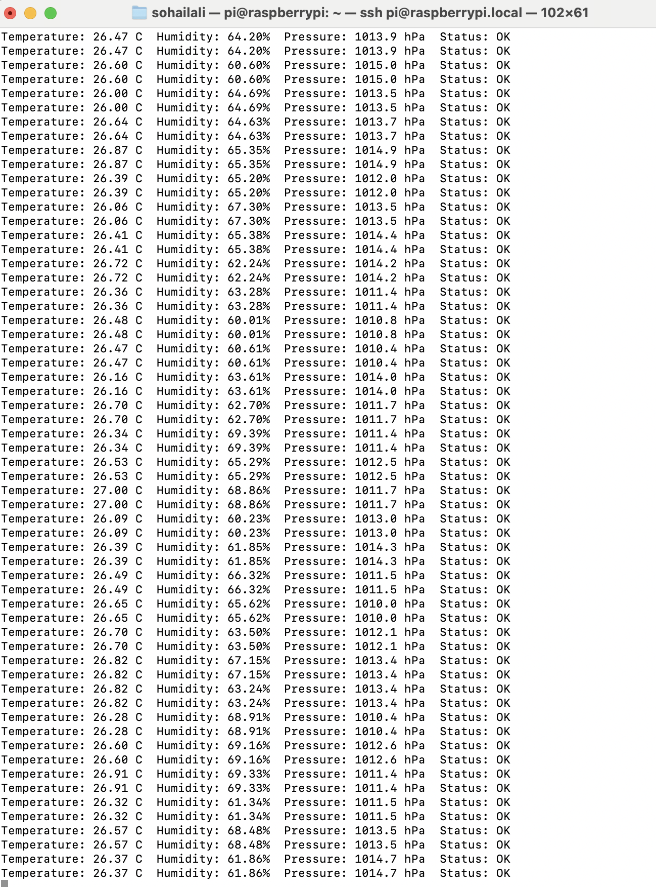
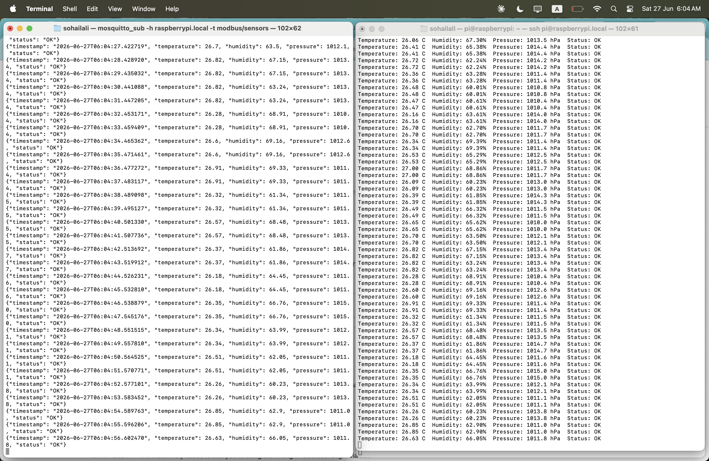
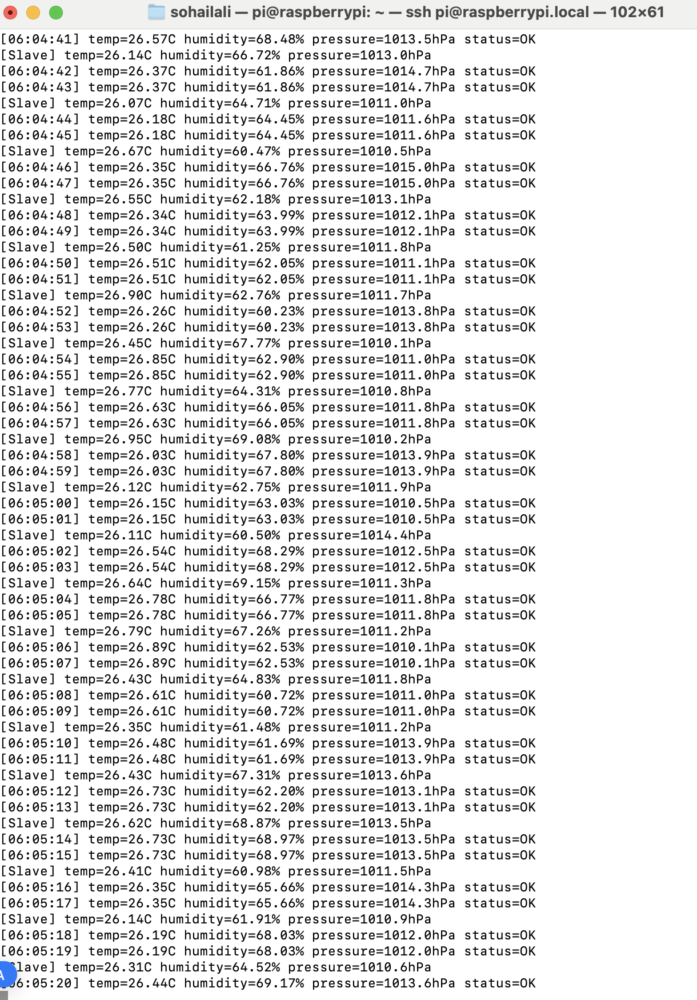

# Modbus RTU to MQTT Gateway — Industrial IoT Bridge

**Author:** Sohail Ali Hassan Abbasi  
**Hardware:** Raspberry Pi 3 Model B+  
**Stack:** Python | pymodbus | paho-mqtt | Mosquitto  
**License:** GPL v2

---

## What This Is

A complete industrial IoT gateway that bridges Modbus RTU (the most common industrial protocol) to MQTT (the standard IoT protocol). The Raspberry Pi acts as a Modbus master polling a simulated industrial sensor device, then publishes the data to an MQTT broker for remote monitoring.

This is exactly how real industrial IoT gateways work in factories, power plants, and SCADA systems.

---

## System Architecture

```
Modbus Slave (simulated industrial sensor)
    |
    |  Modbus TCP (localhost:5020)
    |  Registers: temperature, humidity, pressure, status
    v
Modbus Master / MQTT Gateway (Raspberry Pi)
    |  reads 4 holding registers every second
    |  converts raw values to engineering units
    |  packages as JSON
    |
    |  MQTT publish (topic: modbus/sensors)
    v
Mosquitto MQTT Broker (port 1883)
    |
    |  WiFi network
    v
Remote subscriber (MacBook / any device)
    |
    v
Live industrial sensor data with timestamps
```

---

## What is Modbus?

Modbus is the most widely used industrial communication protocol. Developed in 1979, it is used in:

```
→ PLCs (Programmable Logic Controllers)
→ Industrial sensors and meters
→ Motor drives and inverters
→ Energy monitoring systems
→ Building automation (HVAC)
→ Water treatment plants
→ Solar and wind energy systems
```

**Modbus Register Types:**

| Register Type | Function Code | Use |
|---------------|--------------|-----|
| Coils         | FC01         | Digital outputs (on/off) |
| Discrete Inputs | FC02       | Digital inputs (read only) |
| Holding Registers | FC03     | Analog values (read/write) |
| Input Registers | FC04       | Analog values (read only) |

We use **Holding Registers (FC03)** — the most common type for sensor data.

**Modbus Data Encoding:**

Modbus registers are 16-bit unsigned integers (0-65535). To represent decimal values:
```
Temperature 26.51°C → stored as 2651 (multiply by 100)
Humidity 65.00%     → stored as 6500 (multiply by 100)
Pressure 1013.2 hPa → stored as 10132 (multiply by 10)
```

Master reads raw value and divides by scale factor to get real value.

---

## Register Map

| Address | Name | Scale | Unit | Example |
|---------|------|-------|------|---------|
| 1 | Temperature | /100 | °C | 2651 = 26.51°C |
| 2 | Humidity | /100 | % | 6500 = 65.00% |
| 3 | Pressure | /10 | hPa | 10132 = 1013.2 hPa |
| 4 | Status | none | 1=OK | 1 = device OK |

---

## Sample Output

### Modbus Slave (simulating sensor)
```
[Slave] temp=26.99C humidity=64.34% pressure=1012.2hPa
[Slave] temp=26.77C humidity=60.56% pressure=1011.9hPa
[Slave] temp=26.07C humidity=66.33% pressure=1014.9hPa
```

### Modbus Master (reading registers)
```
Temperature: 26.97 C  Humidity: 65.10%  Pressure: 1013.2 hPa  Status: OK
Temperature: 26.77 C  Humidity: 61.57%  Pressure: 1010.0 hPa  Status: OK
```

### MQTT Gateway (publishing to broker)
```
[06:04:41] temp=26.57C humidity=68.48% pressure=1013.5hPa status=OK
[06:04:42] temp=26.37C humidity=61.86% pressure=1014.7hPa status=OK
```

### MacBook Subscriber (receiving JSON)
```json
{"timestamp": "2026-06-27T06:04:27", "temperature": 26.7, "humidity": 63.5, "pressure": 1012.1, "status": "OK"}
{"timestamp": "2026-06-27T06:04:28", "temperature": 26.82, "humidity": 67.15, "pressure": 1013.4, "status": "OK"}
```

---

## How to Run

### Step 1 — Start Modbus slave (simulated sensor)
```bash
python3 modbus_slave.py &
```

### Step 2 — Test with Modbus master only
```bash
python3 modbus_master.py
```

### Step 3 — Run full gateway (Modbus → MQTT)
```bash
python3 modbus_mqtt_gateway.py
```

### Step 4 — Subscribe on MacBook
```bash
mosquitto_sub -h raspberrypi.local -t "modbus/sensors"
```

---

## Installation

```bash
# Install pymodbus
pip3 install pymodbus==3.6.9 --break-system-packages

# Install paho-mqtt
pip3 install paho-mqtt --break-system-packages

# Install and configure Mosquitto
sudo apt install mosquitto mosquitto-clients -y
sudo systemctl enable mosquitto

# Configure external access
sudo nano /etc/mosquitto/mosquitto.conf
# Add:
# listener 1883
# allow_anonymous true
sudo systemctl restart mosquitto
```

---

## Files

```
08-modbus-mqtt-gateway/
├── modbus_slave.py         <- simulates industrial sensor device
├── modbus_master.py        <- polls Modbus registers, displays data
├── modbus_mqtt_gateway.py  <- bridges Modbus to MQTT broker
├── demo/                   <- screenshots of live system
└── README.md               <- this file
```

---

## Demo Screenshots

### MacBook receiving live JSON from MQTT


### Side by side — MQTT subscriber and Modbus master


### Modbus master formatted output


### Modbus slave generating sensor data


### Gateway running with slave and master together


---

## Real-World Application

In production this system would be:

```
Real Modbus Device (PLC, energy meter, sensor)
    |
    |  RS485 serial cable (industrial standard)
    v
Raspberry Pi with RS485 HAT
    |  pymodbus reads real Modbus RTU frames
    |
    |  MQTT publish
    v
Cloud MQTT Broker (AWS IoT Core / HiveMQ)
    |
    v
Grafana Dashboard / SCADA System
```

The only difference between this project and production is:
- Replace TCP with RS485 serial (`/dev/ttyUSB0`)
- Replace simulated slave with real Modbus device
- Replace local broker with cloud broker

---

## Skills Demonstrated

- Modbus RTU protocol — holding registers, function codes, data encoding
- pymodbus library — both server (slave) and client (master)
- Industrial IoT gateway design — protocol bridging
- MQTT integration — converting industrial protocol to IoT protocol
- JSON data packaging for IoT payloads
- Asyncio Python — async server and client
- Real-time industrial data pipeline

---

## Why This Matters for Clients

Every industrial automation job on Upwork requires Modbus knowledge. This project demonstrates:

```
✓ Understanding of industrial protocols
✓ Ability to read and decode Modbus registers
✓ IoT gateway development
✓ Protocol conversion (Modbus → MQTT)
✓ Python async programming
✓ Real-time data pipeline design
```
