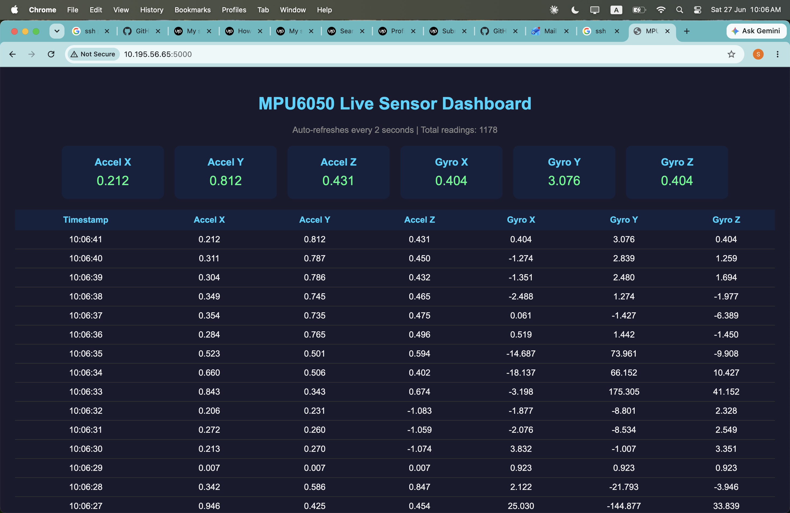
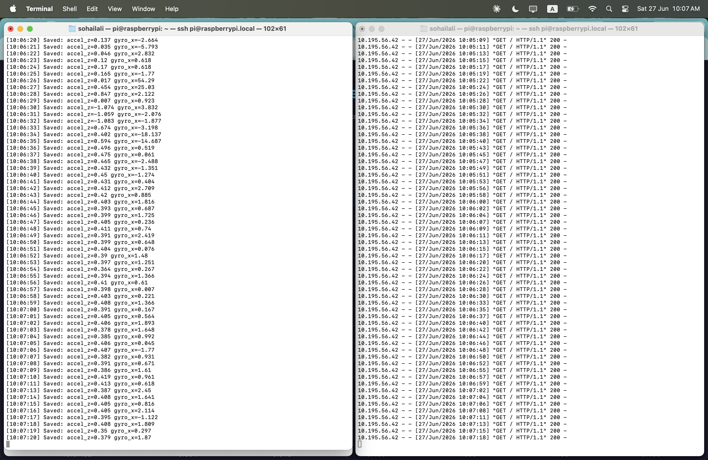
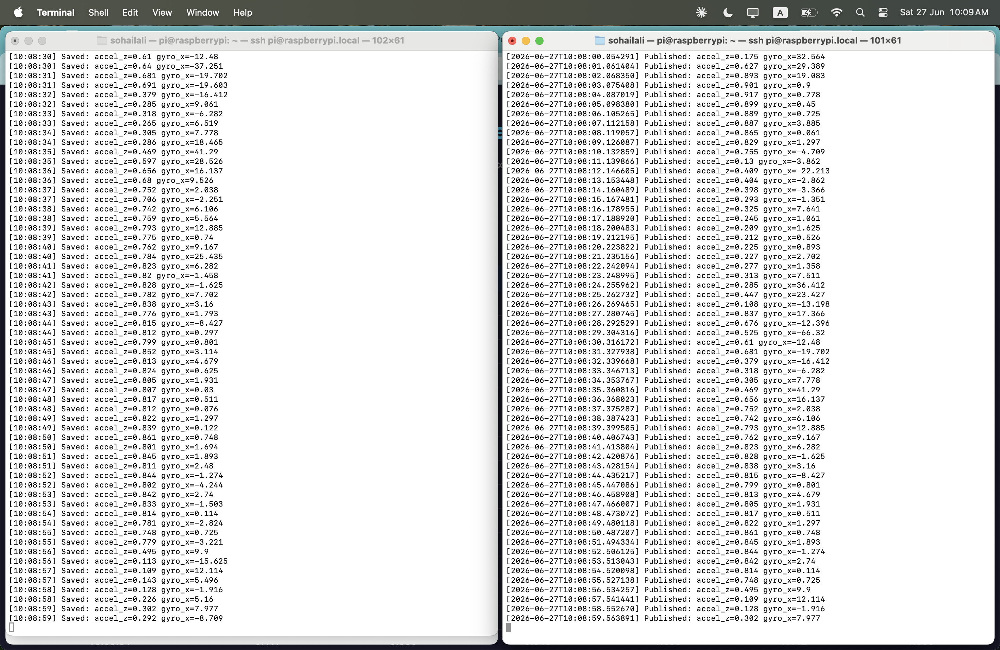

# Flask Sensor Dashboard — MPU6050 Live Web Interface

**Author:** Sohail Ali Hassan Abbasi  
**Hardware:** Raspberry Pi 3 Model B+ | MPU6050  
**Stack:** Python | MQTT | SQLite | Flask | HTML/CSS  
**License:** GPL v2

---

## What This Is

A complete IoT web dashboard that reads live accelerometer and gyroscope data from a Linux kernel driver, stores it in a SQLite database, and serves it as a real-time web interface accessible from any device on the network.

No cloud required. No external services. Runs entirely on Raspberry Pi.

---

## System Architecture

```
MPU6050 Sensor (I2C address 0x68)
     |
     |  I2C bus
     v
mpu6050.ko — Linux kernel driver
     |
     |  sysfs — /sys/kernel/mpu6050/
     v
mpu6050_publisher.py
     |
     |  MQTT — topic: sensor/mpu6050
     v
Mosquitto MQTT Broker (port 1883)
     |
     v
mqtt_logger.py
     |
     |  SQLite — /home/pi/sensor_data.db
     v
flask_dashboard.py
     |
     |  HTTP — port 5000
     v
Browser (any device on network)
     |
     v
Live dashboard — auto-refreshes every 2 seconds
```

---

## Dashboard Features

```
✓ Live sensor cards — latest value for all 6 axes
✓ Reading counter — total readings stored
✓ History table — last 50 readings with timestamps
✓ Auto-refresh — updates every 2 seconds automatically
✓ Dark theme — professional appearance
✓ Network accessible — any device on same WiFi
✓ No internet required — fully local
```

---

## Sample Output

### Browser Dashboard
All 6 sensor axes displayed as live cards:

```
Accel X: 0.212    Accel Y: 0.812    Accel Z: 0.431
Gyro X:  0.404    Gyro Y:  3.076    Gyro Z:  0.404
```

History table shows last 50 readings with timestamps:

```
Timestamp  | Accel X | Accel Y | Accel Z | Gyro X  | Gyro Y  | Gyro Z
10:06:41   | 0.212   | 0.812   | 0.431   | 0.404   | 3.076   | 0.404
10:06:40   | 0.311   | 0.787   | 0.450   | -1.274  | 2.839   | 1.259
10:06:39   | 0.304   | 0.786   | 0.432   | -1.351  | 2.480   | 1.694
```

### SQLite Logger
```
[10:06:20] Saved: accel_z=0.137 gyro_x=-2.664
[10:06:21] Saved: accel_z=0.035 gyro_x=-5.793
[10:06:22] Saved: accel_z=0.046 gyro_x=2.832
```

---

## How to Run

### Prerequisites

```bash
# Load MPU6050 kernel driver
sudo insmod ~/kernel_modules/mpu6050.ko
echo "mpu6050 0x68" | sudo tee /sys/bus/i2c/devices/i2c-1/new_device

# Verify sensor working
cat /sys/kernel/mpu6050/accel_z

# Install dependencies
pip3 install paho-mqtt flask --break-system-packages
```

### Step 1 — Start MQTT publisher (Terminal 1)

```bash
python3 mpu6050_publisher.py
```

### Step 2 — Start database logger (Terminal 2)

```bash
python3 mqtt_logger.py
```

### Step 3 — Start web dashboard (Terminal 3)

```bash
python3 flask_dashboard.py
```

### Step 4 — Open in browser

```
http://raspberrypi.local:5000
```

Or use Pi's IP address:

```
http://10.x.x.x:5000
```

Dashboard auto-refreshes every 2 seconds. No manual refresh needed.

---

## Database Schema

SQLite database stored at `/home/pi/sensor_data.db`:

```sql
CREATE TABLE sensor_readings (
    id        INTEGER PRIMARY KEY AUTOINCREMENT,
    timestamp TEXT,
    accel_x   REAL,
    accel_y   REAL,
    accel_z   REAL,
    gyro_x    REAL,
    gyro_y    REAL,
    gyro_z    REAL
);
```

Query historical data directly:

```bash
sqlite3 /home/pi/sensor_data.db
SELECT * FROM sensor_readings ORDER BY id DESC LIMIT 10;
SELECT COUNT(*) FROM sensor_readings;
SELECT AVG(accel_z) FROM sensor_readings;
```

---

## Installation

```bash
# Clone repo
git clone https://github.com/salihassan706/embedded-linux-drivers
cd embedded-linux-drivers/09-flask-sensor-dashboard

# Install dependencies
pip3 install paho-mqtt flask --break-system-packages

# Configure Mosquitto
sudo apt install mosquitto -y
sudo systemctl enable mosquitto
echo "listener 1883" | sudo tee -a /etc/mosquitto/mosquitto.conf
echo "allow_anonymous true" | sudo tee -a /etc/mosquitto/mosquitto.conf
sudo systemctl restart mosquitto
```

---

## Files

```
09-flask-sensor-dashboard/
├── mqtt_logger.py       <- MQTT subscriber, saves to SQLite
├── flask_dashboard.py   <- Flask web server, serves live data
├── demo/                <- screenshots of live system
│   ├── dashboard.png           <- browser dashboard
│   ├── logger_flask.png        <- logger + Flask terminal
│   └── publisher_logger.png    <- publisher + logger side by side
└── README.md            <- this file
```

---

## Demo Screenshots

### Live Browser Dashboard


### Logger Saving Data + Flask Serving Requests


### Publisher and Logger Running Together


---

## Extending This Project

```
→ Add Chart.js for real-time graphs
→ Add REST API endpoints for external access
→ Add data export to CSV download
→ Add alert thresholds — notify when gyro exceeds limit
→ Deploy with nginx + gunicorn for production
→ Add user authentication
→ Store data in PostgreSQL for larger scale
→ Add Grafana dashboard for advanced visualization
```

---

## Skills Demonstrated

- MQTT subscriber with paho-mqtt
- SQLite database — schema creation, INSERT, SELECT
- Flask web framework — routes, template rendering
- Jinja2 templating — dynamic HTML generation
- HTML/CSS dark theme dashboard
- Full IoT stack — kernel driver to web browser
- Real-time data pipeline with auto-refresh
- Local network web server deployment
